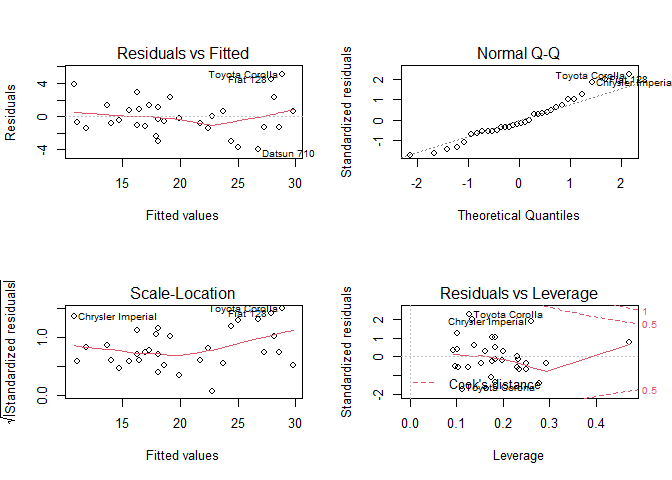

## Overview
This is a course project of the Regression Models MOOC by JHU.
The relationship between mpg and am variables in mtcars dataset will be examined by regression. Mpg is an abbreviation for miles per gallon,
and is a measure of fuel efficiency. Am represents if the car is automatic (am==0) or manual (am==1). For more information about the dataset, please visit:

https://stat.ethz.ch/R-manual/R-devel/library/datasets/html/mtcars.html

## Exploratory Analysis

Load the data and simply explore it.


```r
library(datasets)
library(ggplot2)
data(mtcars)
str(mtcars)
```

```
## 'data.frame':	32 obs. of  11 variables:
##  $ mpg : num  21 21 22.8 21.4 18.7 18.1 14.3 24.4 22.8 19.2 ...
##  $ cyl : num  6 6 4 6 8 6 8 4 4 6 ...
##  $ disp: num  160 160 108 258 360 ...
##  $ hp  : num  110 110 93 110 175 105 245 62 95 123 ...
##  $ drat: num  3.9 3.9 3.85 3.08 3.15 2.76 3.21 3.69 3.92 3.92 ...
##  $ wt  : num  2.62 2.88 2.32 3.21 3.44 ...
##  $ qsec: num  16.5 17 18.6 19.4 17 ...
##  $ vs  : num  0 0 1 1 0 1 0 1 1 1 ...
##  $ am  : num  1 1 1 0 0 0 0 0 0 0 ...
##  $ gear: num  4 4 4 3 3 3 3 4 4 4 ...
##  $ carb: num  4 4 1 1 2 1 4 2 2 4 ...
```

Some variables are actually factor variables. They should be used accordingly.


```r
mtcars$cyl = as.factor(mtcars$cyl)
mtcars$vs = as.factor(mtcars$vs)

mtcars$am = as.factor(mtcars$am)
levels(mtcars$am) = c("Automatic", "Manual")

mtcars$gear = as.factor(mtcars$gear)
mtcars$carb = as.factor(mtcars$carb)
```


Draw a boxplot of data. See Appendix, ***A1*** . 
Automatic cars seem to have lower mpg.

## Significance of the Difference

Check if mpg values of automatic cars are significantly less than manual cars. 

```r
t.test(mpg~am , data=mtcars , alternative = "less")$p.value
```

```
## [1] 0.0006868192
```
Since p-value is much less than 0.05, there is enough evidence to reject the null hypothesis and state that automatic cars have lower mpg values . 

## Creating Regression Model

Trying a model which mpg depends only on ***am***  variable (automatic - manual)

```r
single_model = lm(mpg ~ am, mtcars)
summary(single_model)
```

```
## 
## Call:
## lm(formula = mpg ~ am, data = mtcars)
## 
## Residuals:
##     Min      1Q  Median      3Q     Max 
## -9.3923 -3.0923 -0.2974  3.2439  9.5077 
## 
## Coefficients:
##             Estimate Std. Error t value Pr(>|t|)    
## (Intercept)   17.147      1.125  15.247 1.13e-15 ***
## amManual       7.245      1.764   4.106 0.000285 ***
## ---
## Signif. codes:  0 '***' 0.001 '**' 0.01 '*' 0.05 '.' 0.1 ' ' 1
## 
## Residual standard error: 4.902 on 30 degrees of freedom
## Multiple R-squared:  0.3598,	Adjusted R-squared:  0.3385 
## F-statistic: 16.86 on 1 and 30 DF,  p-value: 0.000285
```
This model suggests a manual car has 7.245 higher mpg than an automatic one. The coefficients are significant but R-squared is **0.36** . Thus, this model only explains %36 of variance in data and obviously is not a sufficient model.

&nbsp;

For a better model, first create a model using all variables, then with step function find a good model.

```r
final_model = step(lm(mpg ~ . ,mtcars), trace= FALSE)
summary(final_model)
```

```
## 
## Call:
## lm(formula = mpg ~ cyl + hp + wt + am, data = mtcars)
## 
## Residuals:
##     Min      1Q  Median      3Q     Max 
## -3.9387 -1.2560 -0.4013  1.1253  5.0513 
## 
## Coefficients:
##             Estimate Std. Error t value Pr(>|t|)    
## (Intercept) 33.70832    2.60489  12.940 7.73e-13 ***
## cyl6        -3.03134    1.40728  -2.154  0.04068 *  
## cyl8        -2.16368    2.28425  -0.947  0.35225    
## hp          -0.03211    0.01369  -2.345  0.02693 *  
## wt          -2.49683    0.88559  -2.819  0.00908 ** 
## amManual     1.80921    1.39630   1.296  0.20646    
## ---
## Signif. codes:  0 '***' 0.001 '**' 0.01 '*' 0.05 '.' 0.1 ' ' 1
## 
## Residual standard error: 2.41 on 26 degrees of freedom
## Multiple R-squared:  0.8659,	Adjusted R-squared:  0.8401 
## F-statistic: 33.57 on 5 and 26 DF,  p-value: 1.506e-10
```
This model has more variables than the first model. Thus the mpg difference between manual and automatic cars is lower than the first model, it is only 1.81 mpg. R-squared of the model is **0.865** which means the model can explain %86 of the variance in data. See **A2** for residual analysis. The model is good enough.

&nbsp;

Perform ANOVA test to compare the models.

```r
anova(single_model,final_model)
```

```
## Analysis of Variance Table
## 
## Model 1: mpg ~ am
## Model 2: mpg ~ cyl + hp + wt + am
##   Res.Df    RSS Df Sum of Sq      F    Pr(>F)    
## 1     30 720.90                                  
## 2     26 151.03  4    569.87 24.527 1.688e-08 ***
## ---
## Signif. codes:  0 '***' 0.001 '**' 0.01 '*' 0.05 '.' 0.1 ' ' 1
```
The models are significantly different.

## Conclusion

Estimating mpg only by am is not sufficient and overestimates the mpg difference. By using final_model, it can be stated that on average manual cars have 1.81 higher mpg than automatic ones.

## Appendix

### A1: Automatic vs. Manual Cars MPG Comparison

<!-- -->

### A2: Residual Plots of Final Model

<!-- -->


